# 🔥 Notely Firebase

A Flutter notes app upgraded with **real Firebase Auth & Firestore cloud sync** — built as part of the **Qwetrum Technologies Flutter Internship (June 2026 Cohort)**.

> ⭐ This is the **Firebase version** of Notely. The local SQLite version is available at [Notely_sqlite](https://github.com/DuaAkbar/Notely_sqlite).

---

## ✨ Features

- 🔐 **Firebase Authentication** — Register, Login, Logout with real Firebase Auth
- 📧 **Forgot Password** — Password reset via Firebase email
- ☁️ **Cloud Sync (Firestore)** — Notes saved to the cloud, sync across devices in real-time
- 👤 **Per-user Notes** — Each user only sees their own notes (UID-based security)
- 🔴 **Offline Mode Indicator** — Red banner appears automatically when internet is lost
- 🔄 **Pull-to-Refresh** — Swipe down gesture on notes list
- 🔍 **Real-time Search** — Filter notes by title or content instantly
- 🎨 **Color-coded Notes** — Scrollable pastel color picker
- 📋 **Grid / List View Toggle** — Switch between views from the AppBar
- ⚡ **GetX** — State management, navigation, and dependency injection

---

## 🔐 Auth Screens

| Login | Forget Password | Reset Email Received |
|-------|----------------|----------------------|
| 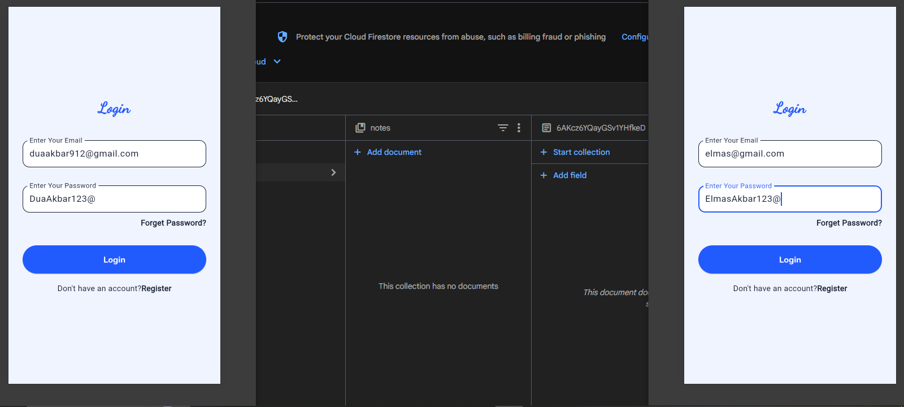 | 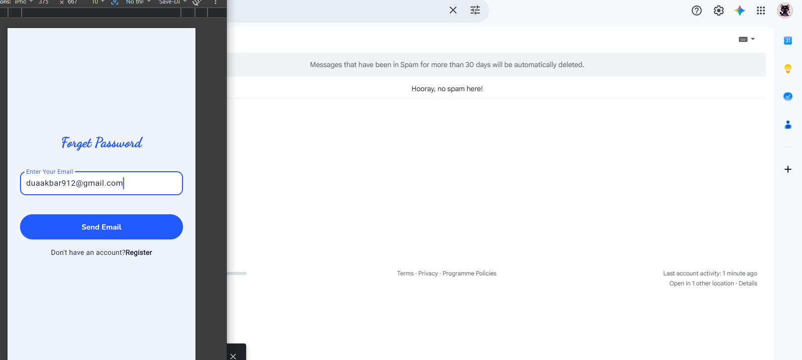 | 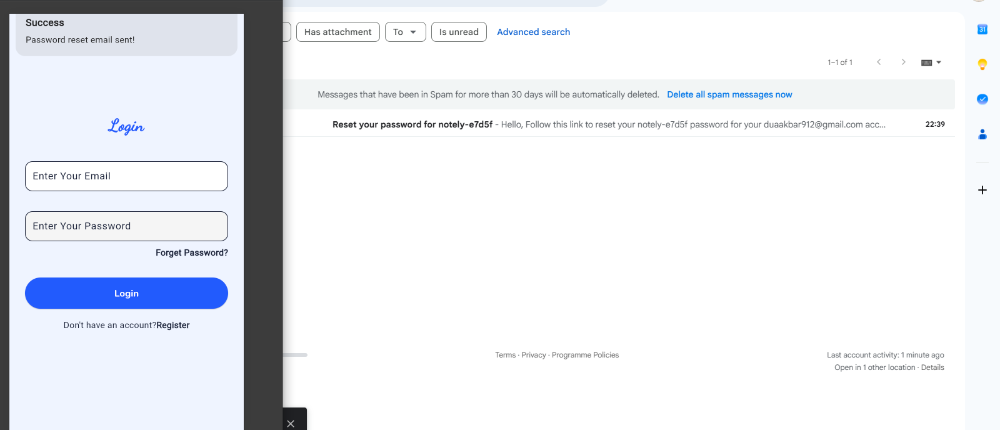 |

---

## 🏠 Home Screen

| Two Users — Empty | Two Users — With Notes | Offline Banner |
|-------------------|----------------------|----------------|
| 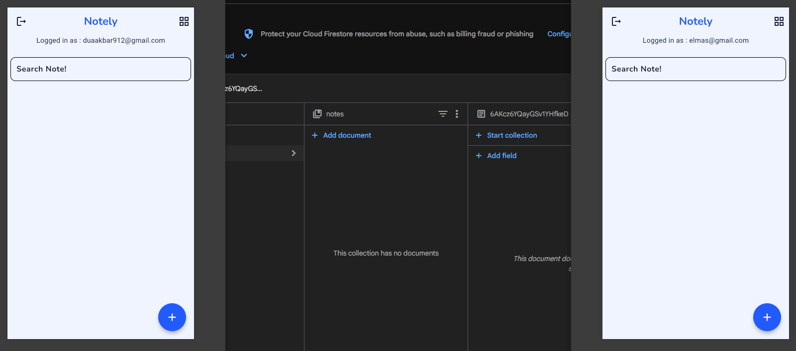 | 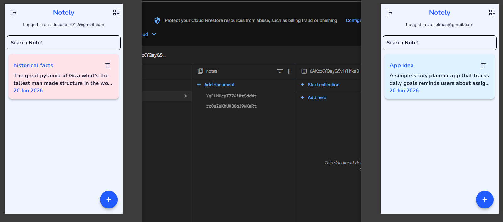 | 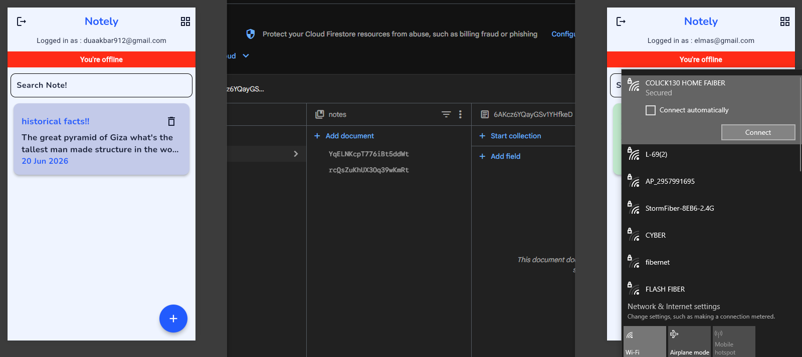 |

---

## 📝 Note Screens

| Add Note | Edit Note | Note Detail |
|----------|-----------|-------------|
| 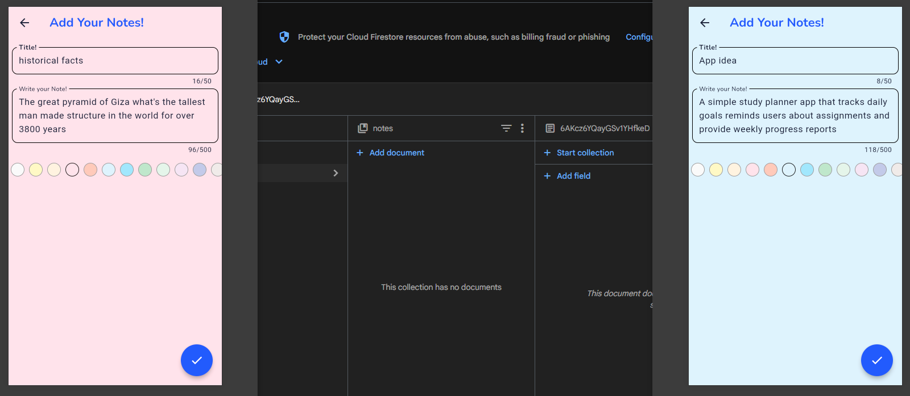 | 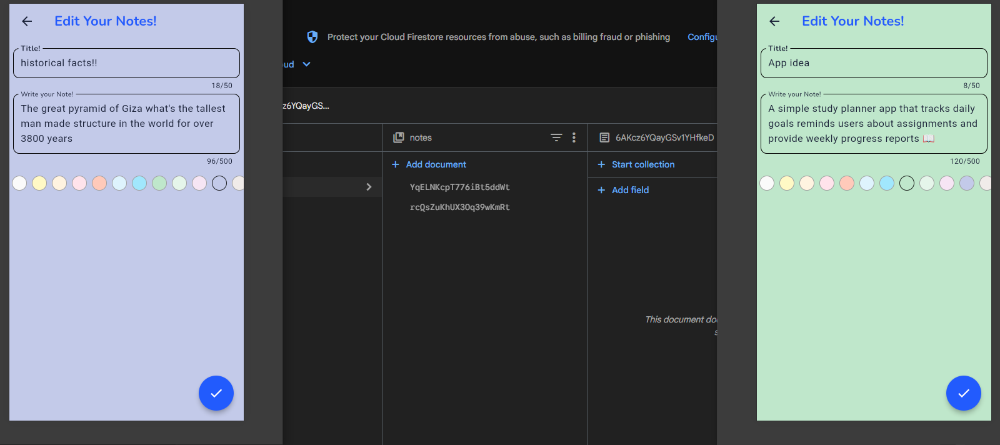 | 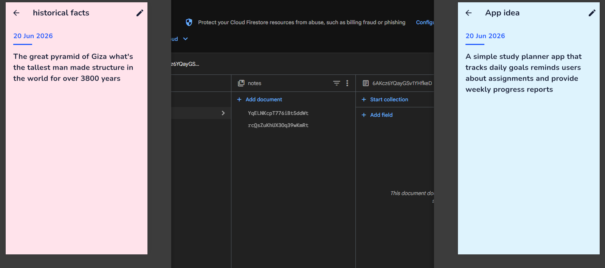 |

---

## 🔄 Real-Time Sync — Two Sessions

| Two Users Logging In | Notes Synced After Adding | Notes Detail Synced |
|----------------------|--------------------------|---------------------|
| 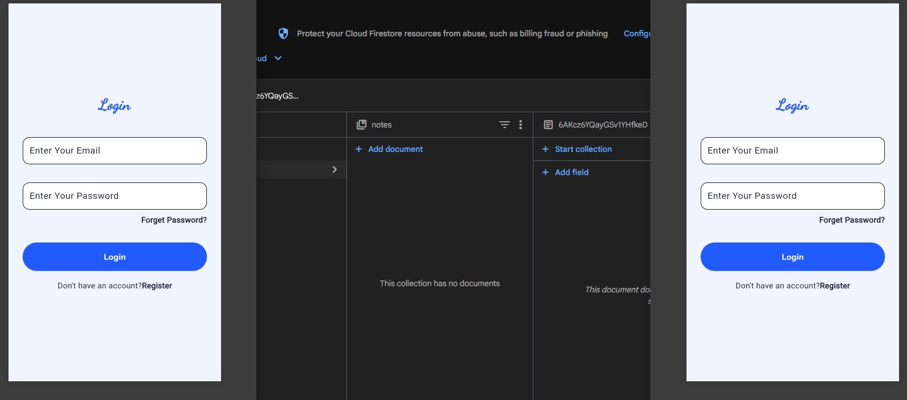 |  | 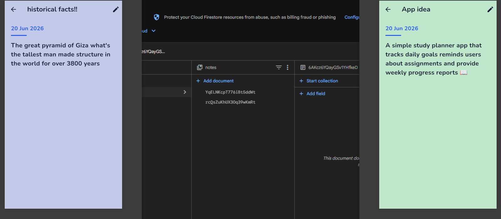 |

> Both sessions open simultaneously — each user sees only their own notes, synced live via Firestore.

---

## 🛠️ Tech Stack

| Technology | Purpose |
|------------|---------|
| **Flutter** | UI Framework |
| **Dart** | Language |
| **Firebase Auth** | Real authentication |
| **Cloud Firestore** | Cloud database & real-time sync |
| **GetX** | State management & navigation |
| **connectivity_plus** | Offline detection |
| **intl** | Date formatting |
| **form_validator** | Form validation |
| **Nunito & Dancing Script** | Custom fonts |

---

## 📦 Packages Used

```yaml
get: ^4.6.6
firebase_core: ^3.13.0
firebase_auth: ^5.5.3
cloud_firestore: ^5.6.7
connectivity_plus: ^7.1.1
intl: ^0.19.0
form_validator: ^2.1.1
```

---

## 🔒 Firestore Security Rules

Notes are protected at the database level — users can only read/write their own notes:

```
rules_version = '2';
service cloud.firestore {
  match /databases/{database}/documents {
    match /notes/{noteId} {
      allow create: if request.auth != null
                     && request.auth.uid == request.resource.data.uid;
      allow read, update, delete: if request.auth != null
                     && request.auth.uid == resource.data.uid;
    }
  }
}
```

---

## 🚀 Getting Started

```bash
# Clone the repository
git clone https://github.com/DuaAkbar/Notely_firebase.git

# Navigate to project
cd Notely_firebase

# Install dependencies
flutter pub get

# Run the app
flutter run
```

> ⚠️ This project requires a Firebase project connected via `flutterfire configure`. The `firebase_options.dart` file is excluded from this repo. Set up your own Firebase project and run `flutterfire configure` to generate it.

---

## 📁 Project Structure

```
lib/
├── Controllers/       # GetX controllers (Auth, Notes)
├── models/            # Data models (NotelyModel)
├── services/          # Firestore service
├── auth/              # Login, Register, Forget Password screens
├── views/             # Home, Add, Edit, Note Detail screens
├── utils/             # Colors, helpers
└── theme/             # App theme
```

---

## 👩‍💻 Built By

**Dua Akbar** — Flutter Intern @ [Qwetrum Technologies](https://www.qwetrum.com) · June 2026 Cohort
